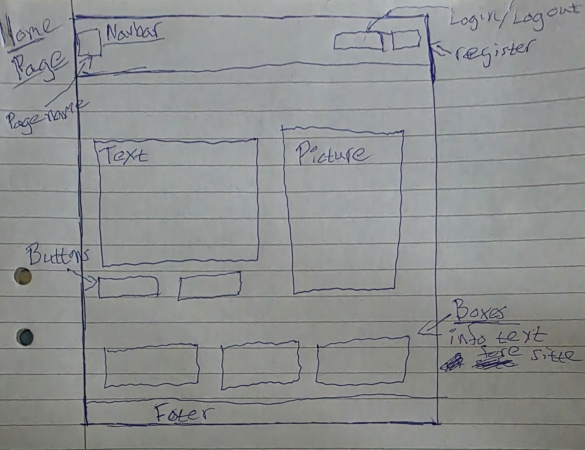
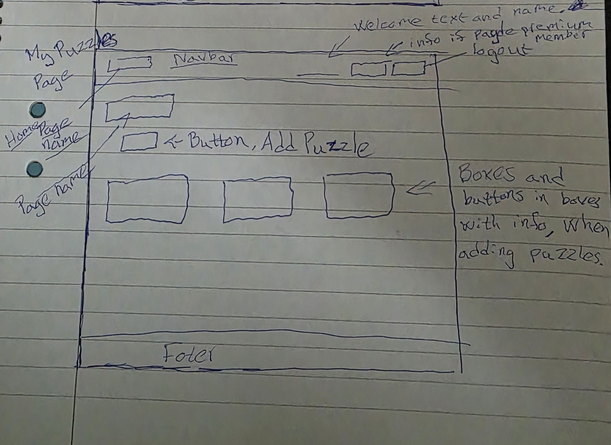
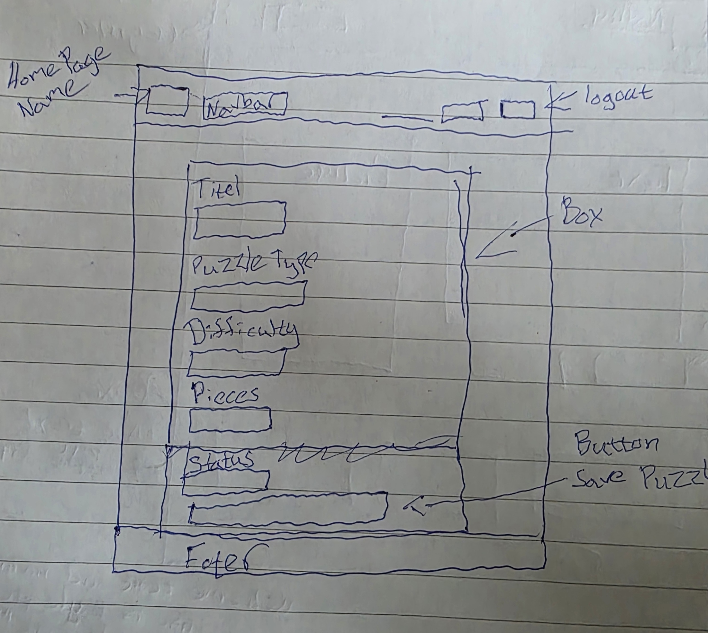
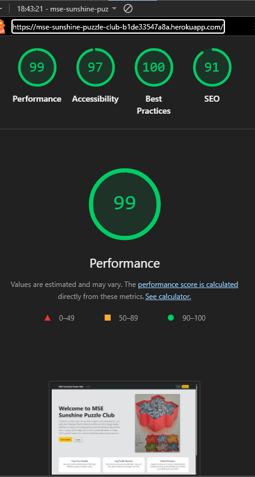
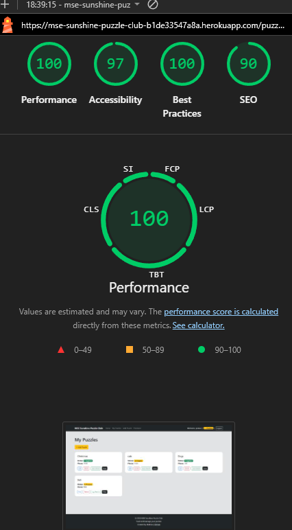

# MSE Sunshine Puzzle Club

MSE Sunshine Puzzle Club is a full-stack Django web application that allows users to track their puzzle collection, manage progress, and upgrade to a premium membership.

---

## 📌 Project Overview

This application provides users with the ability to:

- Create an account and log in
- Add and manage puzzles
- Track puzzle progress
- Upgrade to a premium membership via Stripe
- View their personal puzzle collection

---

## 🎨 Wireframes

Wireframes were created during the planning stage to help structure the layout and user experience of the application.

### Homepage Wireframe

---

### My Puzzles Wireframe

---

### Add Puzzle Wireframe

---

## 🚀 Live Site

👉 https://mse-sunshine-puzzle-club-b1de33547a8a.herokuapp.com/

---

## 👤 Test User

You can create your own account or use:

- Username: testuser  
- Password: Test1234  

(Admin credentials are provided separately if required.)

---

## 🎯 Features

### User Authentication
- Register, login, logout functionality

### Puzzle Management
- Add puzzles
- Track pieces and progress
- View "My Puzzles" dashboard

### Premium Membership
- Stripe payment integration
- Unlock premium features

### Responsive Design
- Works on desktop and mobile devices

---

## 🧪 Testing

Testing details are documented in a separate file:

👉 See TESTING.md for full testing documentation.

---

## 💡 Lighthouse Testing

Lighthouse testing was conducted using Chrome DevTools on the live deployed application.

### Homepage (Logged In)

- Performance: 99
- Accessibility: 97
- Best Practices: 100
- SEO: 91

---

### Homepage (Not Logged In)

- Performance: 99
- Accessibility: 97
- Best Practices: 100
- SEO: 91

---

### My Puzzles Page

- Performance: 100
- Accessibility: 97
- Best Practices: 100
- SEO: 90

---

## 🛠️ Technologies Used

- Python
- Django
- PostgreSQL (Heroku)
- HTML, CSS, Bootstrap
- JavaScript
- Stripe API
- Heroku

---

## 🗄️ Data Schema

The project uses a relational PostgreSQL database to manage users, puzzles, puzzle sessions, and premium membership functionality.

### User Model

Django’s built-in User model is used for authentication and account management.

| Field | Type |
|------|------|
| username | CharField |
| email | EmailField |
| password | CharField |

---

### UserProfile Model

The UserProfile model extends the default Django User model and stores premium membership information.

| Field | Type |
|------|------|
| user | OneToOneField (User) |
| is_premium | BooleanField |

Relationship:
- One User has one UserProfile

---

### Puzzle Model

The Puzzle model stores information about puzzles added by users.

| Field | Type |
|------|------|
| user | ForeignKey (User) |
| title | CharField |
| puzzle_type | CharField |
| pieces | IntegerField |
| difficulty | CharField |
| status | CharField |

Relationship:
- One User can have many Puzzles

---

### PuzzleSession Model

The PuzzleSession model stores progress tracking and session information for each puzzle.

| Field | Type |
|------|------|
| puzzle | ForeignKey (Puzzle) |
| user | ForeignKey (User) |
| session_date | DateField |
| time_spent_minutes | IntegerField |
| notes | TextField |

Relationships:
- One Puzzle can have many PuzzleSessions
- One User can have many PuzzleSessions

---

## 🔗 Entity Relationship Overview

User  
├── UserProfile (OneToOne)  
├── Puzzle (OneToMany)  
│   └── PuzzleSession (OneToMany)  
└── PuzzleSession (OneToMany)

---

## 🚀 Deployment

The project is deployed using Heroku:

1. Create Heroku app  
2. Add PostgreSQL database  
3. Configure environment variables:

    - SECRET_KEY
    - DATABASE_URL
    - STRIPE_PUBLIC_KEY
    - STRIPE_SECRET_KEY

4. Install project requierments:
    
    pip install -r requerments.txt

5. Add a Procfile in the root directory:

    web: gunicorn config.wsgi

6. Configure static files settings in `settings.py`

7. Run migrations:
    
    python manage.py migrate

8. Create superuser:

    python manage.py createsuperuser

9. Deploy via GitHub  

---

### 💻 Local Deployment

To clone this repository:

    git clone https://github.com/deadr1pley/MSE-Sunshine-Puzzle-Club.git

Navigate to the project folder:

    cd MSE-Sunshine-Puzzle-Club

Create a virtual environment:

    python -m venv .venv

Activate the virtual environment (Git Bash):

    source .venv/Scripts/activate

Install requirements:

    pip install -r requirements.txt

Run the server:

    python manage.py runserver

---

### 📁 Static Files

Static files are managed using:

- WhiteNoise
- STATIC_ROOT
- STATICFILES_DIRS

This ensures CSS, images, and styling load correctly in production.

---

## ⚠️ Known Issues

- Minor SEO improvements possible  
- Some heading structure warnings appear during HTML validation due to Django template rendering
- Small UI alignment improvements could still be made on certain form layouts 

---

## 📚 Credits

- Code Institute course material  
- Django documentation  
- Stripe documentation  

---

## 🙌 Acknowledgements

Thanks to Code Institute and the learning platform for guidance throughout the project.