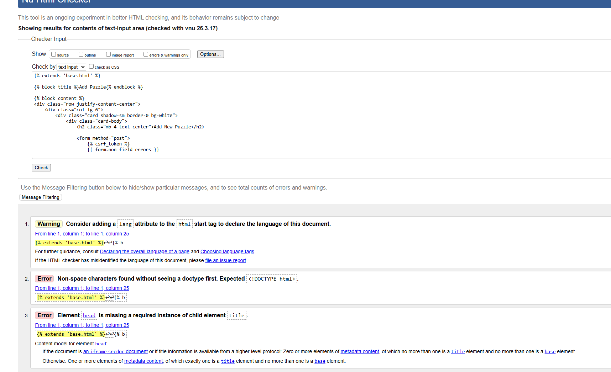
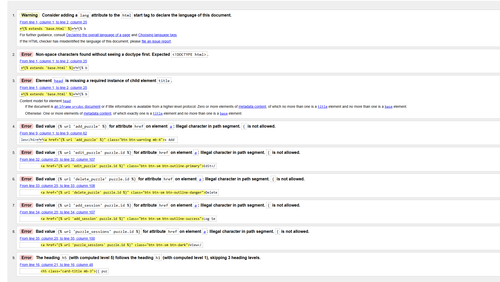

# Testing

## 🧪 Overview

Testing was conducted throughout the development of the project to ensure functionality, usability, and responsiveness.

Both manual testing and validation tools were used to verify the application.

---

## ✅ Manual Testing

### User Authentication

| Feature | Action | Expected Result | Result |
|--------|--------|---------------|--------|
| Register | Create new account | User account created | Pass |
| Login | Enter valid credentials | User logged in | Pass |
| Logout | Click logout | User logged out | Pass |

---

### Puzzle Functionality

| Feature | Action | Expected Result | Result |
|--------|--------|---------------|--------|
| Add Puzzle | Submit form | Puzzle saved to database | Pass |
| View Puzzles | Go to My Puzzles | Puzzles displayed | Pass |
| Puzzle Data | Refresh page | Data persists | Pass |

---

### Premium Feature

| Feature | Action | Expected Result | Result |
|--------|--------|---------------|--------|
| Payment | Click Go Premium | Redirect to Stripe | Pass |
| Success Page | Complete payment | User marked as premium | Pass |

---

### Admin

| Feature | Action | Expected Result | Result |
|--------|--------|---------------|--------|
| Admin Login | Access /admin | Login successful | Pass |
| View Data | Check models | Data visible | Pass |

---

## 📱 Responsiveness

The application was tested manually using Chrome DevTools across different screen sizes:

- Mobile devices
- Tablets
- Desktop screens

All pages remained functional and responsive.

---

## 💡 Lighthouse Testing

### Homepage (Logged In)

- Performance: 99  
- Accessibility: 97  
- Best Practices: 100  
- SEO: 91  

---

### Homepage (Not Logged In)

- Performance: 99  
- Accessibility: 97  
- Best Practices: 100  
- SEO: 91  

---

### My Puzzles Page

- Performance: 100  
- Accessibility: 97  
- Best Practices: 100  
- SEO: 90  

---

## 🔍 HTML Validation

HTML validation was performed using the W3C Validator.

### Base Template

### Add Puzzle Page

### Puzzle List Page

### Notes

Some validation errors appeared due to Django template syntax such as:

- ``
- ``
- ``

These are expected and do not affect functionality.

---

## 🎨 CSS Validation

CSS was validated using the W3C CSS Validator.

### Notes

- One error was found due to incorrect decimal formatting (`0,25s`)
- This was corrected to `0.25s`
- CSS now passes validation

---

## ⚠️ Known Issues

- Some minor heading structure warnings (e.g., h1 followed by h3)
- SEO score slightly below 100

These do not affect functionality.

---

## 🐞 Bugs Fixed

| Bug | Fix |
|----|-----|
| CSS transition error | Corrected comma to dot |
| Image not loading | Fixed static path |
| Server error on deploy | Added database and migrations |

---

## 🚀 Deployment Testing

After deployment to Heroku:

- User registration works
- Login/logout works
- Puzzle creation works
- Database persists data
- Stripe payment flow works

---

## ✅ Final Result

All core features of the application work as intended.

The application has been tested for:

- Functionality
- Responsiveness
- Validation
- Performance

No critical issues remain.